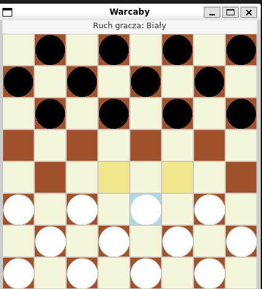

# Warcaby (Checkers) w C z GUI GTK

Prosty projekt gry Warcaby napisany w języku C z graficznym interfejsem użytkownika wykorzystującym bibliotekę GTK.

## 🕹️ Funkcje

- Gra dwuosobowa (lokalna)
- Interfejs graficzny w GTK 3
- Obsługa ruchów, bicia i promocji damki
- Zasady zgodne z klasycznymi warcabami 8x8

## 🖥️ Zrzut ekranu

## 📦 Wymagania

- GTK 3 (lub nowszy)
- Kompilator C (np. `gcc`)
- `pkg-config`

## Kompilacja

gcc main.c -o warcaby `pkg-config --cflags --libs gtk+-3.0`

## Uruchamianie 
 ./warcaby

